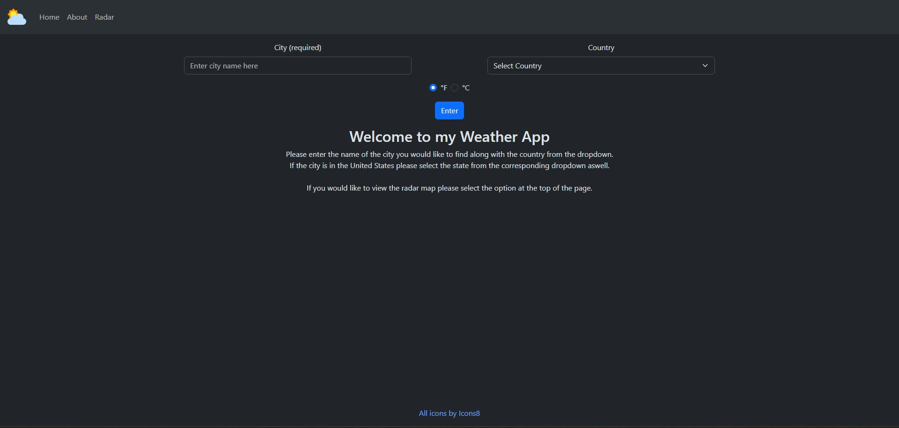
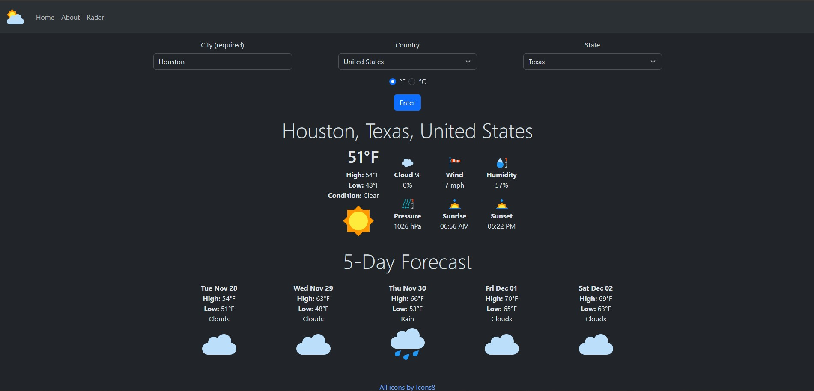
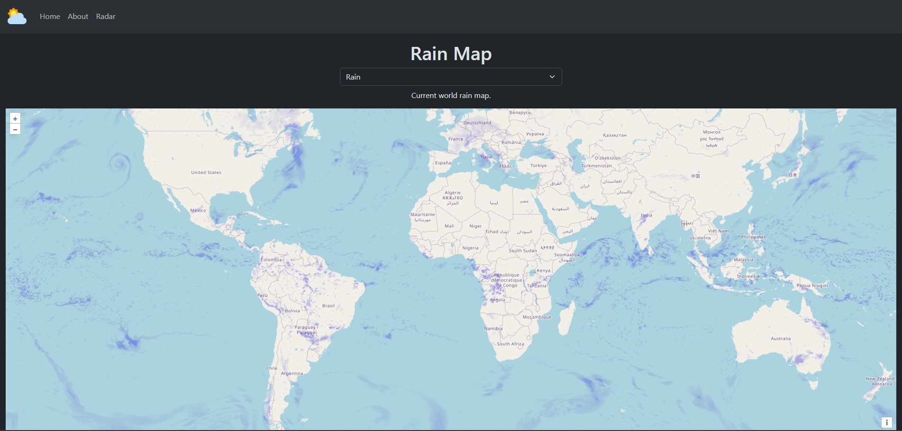

# Weather App Using React.js

This project was done as my personal capstone project for my B.S. degree at SUNY Polytechnic Institute.

## Running the app

To run this project first download and install node and the npm package manager that comes with it: https://nodejs.org/en/download/current

Once installed clone this repo into a directory on your computer and change directory into the frontend folder:

```
cd frontend
```

Go to: https://openweathermap.org/price  
Sign up and generate a free api key and create a .env file in the root directory of the frontend folder with the following format:

```
REACT_APP_API_KEY=YOUR API KEY
REACT_APP_API_URL="https://api.openweathermap.org/data/2.5/weather?"
REACT_APP_API_MAP_URL="https://tile.openweathermap.org/map/"
REACT_APP_API_URL_GEO="http://api.openweathermap.org/geo/1.0/reverse?"
REACT_APP_API_FORECAST="http://api.openweathermap.org/data/2.5/forecast?"
```

Once done open your terminal and run the following commands:

```
npm install
npm run dev
```

The first command will install all the necessary libraries used in this project located in the dependency area of the package.json and the second command will run the app on a localhost server using node.js.

## Technologies

**Client-side:** React, HTML5, CSS, Bootstrap, JavaScript, OpenWeather APIs

**Server:** Node

## Demo

When you first launch the application you will be greeted by the following main menu screen:



After entering a city into the user input prompts a screen will show you the weather for the area you specified:



If you would like to use the interactive radar to view the different maps available you can just click on the radar button at the top of the page.



## Authors

- [@GBaumes](https://github.com/GBaumes)
